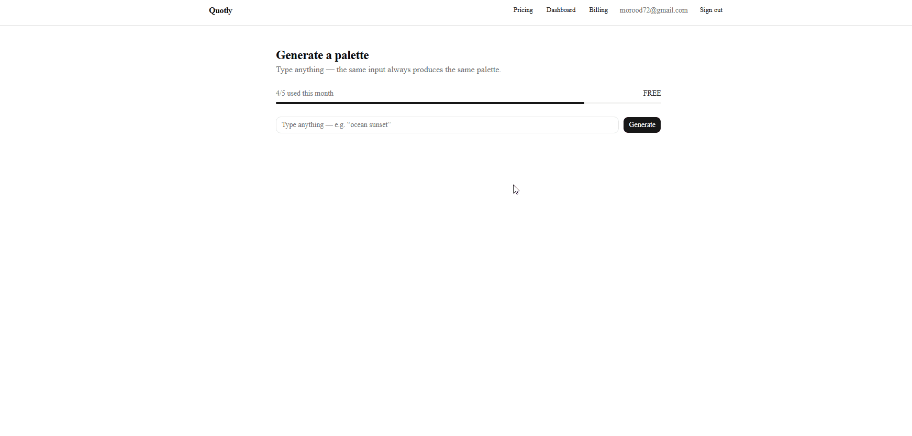

# Quotly

A tiny SaaS with real billing: type a phrase → get a color palette, metered by
a monthly quota tied to a Stripe subscription. Sellers list palettes on a
marketplace and get paid through Stripe Connect — 90% to the seller, 10% to
the platform.

The product is deliberately trivial. The point is the chains around it:
**auth → subscription → quota check → feature access** and
**onboarding → listing → destination charge → split payout.**

| Plan      | Price  | Limit          |
| --------- | ------ | -------------- |
| Free      | $0     | 5 / month      |
| Pro       | $9/mo  | 100 / month    |
| Unlimited | $29/mo | ∞              |

## Live demo

**https://quotly-flax.vercel.app**



**Billing in 60 seconds:**

1. Sign in with a magic link — just an email, no password
2. Generate a palette — watch the quota counter
3. Hit the free limit → upgrade prompt appears
4. Go to `/pricing`, pick Pro
5. Pay with Stripe test card: `4242 4242 4242 4242`, any future date, any CVC
6. Quota jumps from 5 to 100

**Marketplace in 60 seconds:**

1. Click **"Try as seller"** → see listings and Stripe payout status
2. Create a listing, set a price
3. Open an incognito window, click **"Try as buyer"**
4. Buy the listing on `/marketplace` — pay with `4242 4242 4242 4242`
5. Back in the seller dashboard: the sale appears with the 90/10 split

Stripe is in test mode. No real charges.

## Stack

- **Next.js 16** (App Router) + TypeScript
- **Supabase** — Postgres + Auth (Google OAuth + magic links)
- **Prisma 6** — ORM over Supabase Postgres
- **Stripe** — Checkout, Customer Portal, webhooks (test mode)
- **Tailwind + shadcn/ui**
- **React Three Fiber** — 3D preview of each generated palette
- **Vercel** — deployment

## Design decisions

- **Quota is `COUNT(*)`, not a counter.** Usage is computed from the
  `Generation` rows of the current month. A stored counter is state that
  drifts; the rows are the source of truth.
- **`402 Payment Required`** when the quota is exceeded — it's a billing
  boundary, not a permissions problem (`403`).
- **Webhook is idempotent** (`upsert`) — Stripe retries deliveries.
- **Signature check uses the raw body** (`req.text()`, never `req.json()`).
- **`metadata.userId` on the Checkout Session** links Stripe events back to
  the app user.
- **Middleware calls `supabase.auth.getUser()`**, which validates the JWT
  server-side — `getSession()` only trusts the cookie.

### Stripe Connect (marketplace)

- **Express accounts** — Stripe hosts onboarding, KYC and payout details;
  the app only redirects through one-time Account Links. The `refresh_url`
  regenerates an expired link instead of showing an error.
- **Destination charges** — the payment lands on the platform account and
  `transfer_data.destination` + `application_fee_amount` route 90% to the
  seller. The platform owns the customer relationship and refunds.
- **Fees are computed server-side in integer cents** from the DB price —
  never from client input.
- **`account.updated` webhook** flips `chargesEnabled`/`payoutsEnabled`;
  a redirect back from onboarding proves nothing, so selling is gated on
  those flags, not on the return visit.

## Local setup

### 1. Clone & install

```bash
npm install
cp .env.example .env   # then fill in every value
```

### 2. Supabase

1. Create a project at [supabase.com](https://supabase.com).
2. Enable the **Google** provider (Authentication → Providers) and add
   `http://localhost:3000/auth/callback` to the redirect URLs.
3. Copy the project URL + anon key and both connection strings into `.env`.
4. Push the schema and apply RLS:

```bash
npx prisma db push
# then run supabase/rls.sql in the Supabase SQL editor
```

### 3. Stripe (test mode)

1. Create two recurring prices — **Pro $9/mo** and **Unlimited $29/mo** — and
   put their `price_...` ids into `.env`.
2. Forward webhooks locally:

```bash
stripe listen --forward-to localhost:3000/api/stripe/webhook
# copy the whsec_... it prints into STRIPE_WEBHOOK_SECRET
```

3. Enable the **Customer Portal** (Settings → Billing → Customer portal) so
   subscribers can cancel.
4. For the marketplace: enable **Connect** (Connect → Get started, pick
   platform) so Express accounts can be created. Onboarding in test mode
   accepts phone `000 000 0000`, SSN `000000000`, DOB `01/01/1901`, routing
   `110000000`, account `000123456789`.

### 4. Demo account (optional)

Create a user in Supabase Auth (email + password), put the credentials in
`DEMO_EMAIL` / `DEMO_PASSWORD`, and give it a subscription by paying once
with the test card. A daily cron (`vercel.json`) wipes its generations so the
quota never fills up.

### 5. Run

```bash
npm run dev
```

## Deploy (Vercel)

1. Import the repo, set every variable from `.env.example`.
2. Add a production webhook endpoint in Stripe pointing to
   `https://your-app.vercel.app/api/stripe/webhook` (events:
   `checkout.session.completed`, `customer.subscription.updated`,
   `customer.subscription.deleted`) and use its signing secret as
   `STRIPE_WEBHOOK_SECRET`. Add a second endpoint with **"Listen to events
   on Connected accounts"** for `account.updated` and put its secret in
   `STRIPE_CONNECT_WEBHOOK_SECRET`.
3. Add the production URL to Supabase Auth redirect URLs.

## Routes

```
app/
  (marketing)/
    page.tsx              landing
    pricing/page.tsx      plans
    marketplace/page.tsx  public listings with Buy buttons
  (app)/
    dashboard/page.tsx    generator + quota meter
    billing/page.tsx      current subscription, Manage button
    seller/page.tsx       Connect status, listings, sales with split
    purchases/page.tsx    palettes the buyer owns
  api/
    stripe/
      checkout/route.ts   POST → subscription Checkout Session
      portal/route.ts     POST → Customer Portal
      webhook/route.ts    POST → Stripe events (billing + Connect)
    connect/
      onboard/route.ts    POST → Express account + Account Link
    listings/route.ts     POST → create listing (gated on onboarding)
    purchase/route.ts     POST → destination charge with 10% fee
    generate/route.ts     POST → quota check + generation
    demo-login/route.ts   POST → one-click demo session (buyer/seller)
    cron/
      reset-demo/route.ts GET → daily wipe of demo generations
  seller/onboard/refresh/route.ts  regenerates expired Account Links
  auth/callback/route.ts  Supabase OAuth/magic-link callback
proxy.ts                  protects /dashboard, /billing, /seller, /purchases
```
